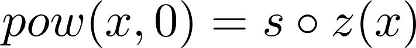
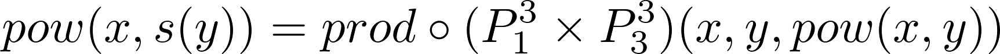

# Primitive Recursive Functions
This is a simple implementation of a `pow(x, y)` 
which performs the power between `x` and `y`, Using 
primitive recursive functions.

### Formal respresentation
The formal representation of the function `pow(x, y)`,
using [primitive recursion](https://www.encyclopediaofmath.org/index.php/Primitive_recursion)
is this:





### Execution
To execute the program use the `.jar` file on the directory.
```
java -jar jar/RecursivePrimitiveFunctions.jar x y
```

where:

* `x`: positive base of the power.
* `y`: positive exponent of the power.

### Example of execution
```
$ java -jar jar/RecursivePrimitiveFunctions.jar 7 4
pow(7, 4) = 2401
```

## Author

* **Cristian Abrante Dorta** - [CristianAbrante](https://github.com/CristianAbrante)